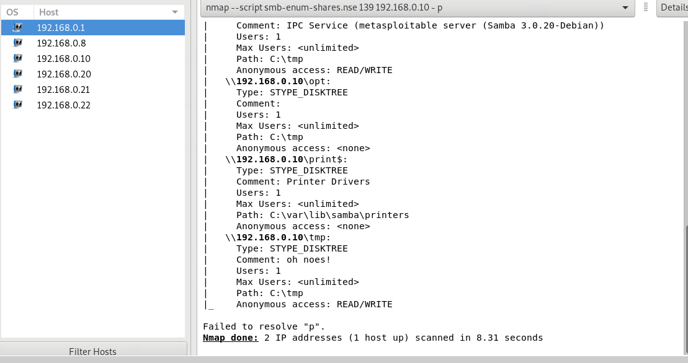

## Week 16 Homework Submission File: Penetration Testing 1

#### Step 1: Google Dorking

- Using Google, can you identify who the Chief Executive Officer of Altoro Mutual is: Answer:  Karl Fitzgerald

- How can this information be helpful to an attacker: Answer: Karl Fitzgerald can be the target of 1) Phishing Attacks 2) Passwork Cracking based information gathered form  digitial footprint to eavesdroping of communications 3) theft of personal and work (digital devices (laotops, smartphones, tablets, etc.) to access the company's databases.

#### Step 2: DNS and Domain Discovery

Enter the IP address for `demo.testfire.net` into Domain Dossier and answer the following questions based on the results:

  1. Where is the company located: Answer: Sunnyvale, CA 

  2. What is the NetRange IP address: Answer:  65.61.137.64 - 65.61.137.127

  3. What is the company they use to store their infrastructure: Answer:  Rackspace Backbone Engineering

  4. What is the IP address of the DNS server: Answer: 65.61.137.117

#### Step 3: Shodan

- What open ports and running services did Shodan find: Answer: Port 80, 443, 8080 were open for Apache Tomcat/Coyote JSP engine

#### Step 4: Recon-ng

- Install the Recon module `xssed`. 
- Set the source to `demo.testfire.net`. 
- Run the module. 

Is Altoro Mutual vulnerable to XSS: Answer: Yes, the because the status is unfixed

### Step 5: Zenmap

Your client has asked that you help identify any vulnerabilities with their file-sharing server. Using the Metasploitable machine to act as your client's server, complete the following:

- Command for Zenmap to run a service scan against the Metasploitable machine: 
 
- Bonus command to output results into a new text file named `zenmapscan.txt`:

- Zenmap vulnerability script command: 

- Once you have identified this vulnerability, answer the following questions for your client:
  1. What is the vulnerability: Answer: 192.168.0.10 can be accessed the system via SAMBA

  2. Why is it dangerous: Answer: SAMBA vulnerability  enables hackers to gain access to system to upload and execute shared files.

  3. What mitigation strategies can you recommendations for the client to protect their server: Answer: The system need to be fully patched, it includes the kernel and all applications. The services needs to running in least privileged mode. Firewall needs to be in place to filter packets based on MAC address and the TCP header flags. This will prevent the information gathering process by attacker’s crafted packets.

---
© 2020 Trilogy Education Services, a 2U, Inc. brand. All Rights Reserved.  
